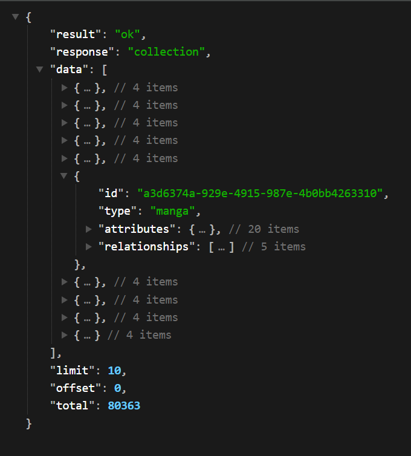

# Manga Bloom

```markdown

___  ___                       ______ _                       
|  \/  |                       | ___ \ |                      
| .  . | __ _ _ __   __ _  __ _| |_/ / | ___   ___  _ __ ___  
| |\/| |/ _` | '_ \ / _` |/ _` | ___ \ |/ _ \ / _ \| '_ ` _ \ 
| |  | | (_| | | | | (_| | (_| | |_/ / | (_) | (_) | | | | | |  
\_|  |_/\__,_|_| |_|\__, |\__,_\____/|_|\___/ \___/|_| |_| |_|
                     __/ |                                    
                    |___/                                     
```

Hey readers, MangaBloom is a manga-binging application for manga/comic **(Japanese Translation: まんが)** fans like myself.  Let’s be real here for a moment,  all of us have tried to read manga on those shady manga websites - yes, the ones where you watch ads more than you read manga. I have grown tired of those and I suspect so have most of you. I bring to you Manga Bloom - It is an ad-free manga-binging application that is built around an open-source Manga API - [MangaDex](https://api.mangadex.org/docs/) and here is how I built it.

There are some constraints we have to address to be a good citizen of the open-source world and respect MangaDex’s terms of usage

1. Credit them - Huge thanks to MangaDex and Scanlation groups for their contribution - us otakus are grateful.
2. No Ads/Paid Service allowed - we have to figure out some kind of money making model to keep the app running - Donations maybe? or maybe we will sell printed Naruto T-shirts, who knows?
3. API rate limit - A strict API rate limit of 5 Requests/sec for all of their APIs - the ones that are serving manga metadata (title, description, chapters, cover pages, artists, authors, tags) and the ones serving digital pages for a given manga. Many of you would question - why not look for a different API that has elevated rate limits. Well, there aren’t any, and web scraping for manga is illegal !!
4. Proxy Requests - MangaDex would not accept any cross-origin requests from our browser client and our server has to proxy client requests to their server. If you are not the brightest apple in the bunch like me, here’s an example of what I just said- If a browser client requests a manga page from our server, we cannot simply provide them MangaDex’s image URL, we would have to download the image on our server and serve the client with the image. 


Now that we have got constraints out of the way, let's take some technical decisions, shall we? which I am lowkey sure will come back to bite me later

1. Language - My Programming language of choice is NodeJS because it is asynchronous, non-main-thread-blocking, event-driven, designed to build scalable network applications, yada, yada, yada - you know how it goes 😅.

**Edit 1** : Now that I have started experimenting and running some concurrency tests, Node JS is not working as good as I expected. I ran some concurrency tests using Autocannon and CPU/memory profiling on a NodeJS API (my use case - some Database querying, error handling and some list traversal and manipulation), and guess what? it was very easy for node api to memory leak, it just consumes too much memory!!. I also tried utilizing all cores of my CPU by using PM2 clustering, but still it was no good. I figure vertical/horizontal scaling would address this issue, but I am working with limited $$$. I will be running some tests with Java (😭) or Go maybe?

```plaintext
Here are the results for Node Concurrency Test:(with clustering enabled PM2)

Concurrency Level:      10000, 1 req each connection
Time taken for tests:   24.770 seconds
Complete requests:      10000
Failed requests:        0
Total transferred:      17430000 bytes
HTML transferred:       15330000 bytes
Requests per second:    403.71 [#/sec] (mean)
Time per request:       24770.321 [ms] (mean)
Time per request:       2.477 [ms] (mean, across all concurrent requests)
Transfer rate:          687.17 [Kbytes/sec] received

Connection Times (ms)
              min  mean[+/-sd] median   max
Connect:        0    2  30.9      0     516
Processing:  1401 12624 6676.4  12231   24001
Waiting:        5 11846 6856.7  11414   23641
Total:       1401 12626 6676.4  12231   24001
```

**Edit 2** : I did same tests for Go API

```plaintext
Concurrency Level:      10000
Time taken for tests:   6.862 seconds
Complete requests:      10000
Failed requests:        0
Total transferred:      22940000 bytes
HTML transferred:       22060000 bytes
Requests per second:    1457.30 [#/sec] (mean)
Time per request:       6861.991 [ms] (mean)
Time per request:       0.686 [ms] (mean, across all concurrent requests)
Transfer rate:          3264.70 [Kbytes/sec] received

Connection Times (ms)
              min  mean[+/-sd] median   max
Connect:        0    0  10.2      0     514
Processing:  1039 2956 1121.9   2856    5389
Waiting:       20 2610 1093.6   2339    5384
Total:       1039 2956 1122.1   2856    5389
```

```plaintext
Concurrency Level:      10000
Time taken for tests:   49.226 seconds
Complete requests:      100000
Failed requests:        0
Total transferred:      229400000 bytes
HTML transferred:       220600000 bytes
Requests per second:    2031.45 [#/sec] (mean)
Time per request:       4922.593 [ms] (mean)
Time per request:       0.492 [ms] (mean, across all concurrent requests)
Transfer rate:          4550.92 [Kbytes/sec] received

Connection Times (ms)
              min  mean[+/-sd] median   max
Connect:        0    0   6.3      0     627
Processing:   231 4651 2916.2   4099   32239
Waiting:        1 3834 2947.0   2989   32130
Total:        232 4651 2916.2   4100   32240
```


2. Database - Now technically, we could work without an actual database since our data is managed by MangaDex but that rate limit of 5 req/sec hurts a bit and is a bottleneck we have to address before we design our app. There are many solutions to this problem, one I could come up with is as follows:
    1. The first step is to identify the data that is going to be accessed the most. As a manga-binging veteran, I suspect it is going to be the metadata about the manga than the actual manga pages.
    2. The second step is that we need to seed our local database with manga metadata. This should relieve us significantly from the API rate limit.  Unfortunately, this means we have to manage the data ourselves and keep taking periodic updates from the MangaDex API but, given our circumstances, I am willing to take my chances.
    3. The third step is choosing what type of database - relational or NoSQL? I think the data we are dealing with is mostly relational. Seeding the database is also a complex process in our case because it's not just a single API call to the MangaDex API to get all the required data but, it is an orchestrated sequence of API requests, and the inserts that are made need to be atomic (transactional). And somewhere down the line, we would have to think about the versioning strategy to periodically update the data and look for newly released chapters and so on - relational databases handle that pretty well. Also, the number of mangas is not that much - around 80000. How do I know? I have read them all. JK, look at the API response - total count
        
        
        
3. Cover Images - Should I download the cover images and keep them hot and ready for access or query them each time upon client request and waste precious API rate limit bandwidth? I think I should host them myself - but I don't want to keep them in a separate file storage solution like S3 as it introduces another service in the equation and it's a bit costly. I can host the cover images on the application server. let’s calculate the memory estimates: 
```code
one cover image size = ~40KB
assume that we generate a smaller image thumbnail whose size = ~4KB
number of covers = ~80,000
memory occupied = (40 + 4) * 80000 = ~3.5GB
```
Now 3.5GB of data is not a lot considering AWS gives 30GB of disk space in the free tier and disk IO would not be that much of a cost since the thumbnail would be served most of the time. I understand the implications this decision has on the horizontal scalability of the system and it tightly couples the system but I would like to first reach that bottleneck and then address it.


4. Chapter Pages - serving chapter pages is the hardest thing for me to figure out. They are very dynamic and they keep changing periodically as new chapters are added/updated. Leaving these incremental updates aside, the sheer size/volume of manga episodes is not something I am prepared to host on my own server and neither I am willing to outsource file handling to a managed service like S3 because I get the feeling that I am reinventing the wheel by doing that and over-engineering for a product in its MVP phase. Some back-of-the-envelope calculations for a popular manga series *ONE PIECE*
    
    

```code
    current number of chapters: 1100
    average pages per chapter: 18
    total pages: 18 * 1100 = 19,800 pages
    average page size for a high-quality image: 600KB
    total storage requirement: 19800 * 600KB = ~11.8GB
    11.8GB !! just for 1 manga, I will admit all mangas are not as big as one piece but still, we are looking at big numbers.
```

## Credits

MangaBloom was made possible with support from the following:

- **[MangaDex](https://mangadex.org/)**: Our primary source for manga metadata, tags, genres, cover images, and other information. We greatly appreciate their comprehensive API and community-driven platform, which allows us to access a wealth of manga content.
- **MangaDex API Documentation**: Thanks to the detailed and well-organized API documentation provided by MangaDex, which helped us seamlessly integrate their data into MangaBloom.

**Acknowledgments**:

A big thank you to the open-source community for their continued contributions to making tools like MangaDex, PostgreSQL, and templating engines freely available and well-maintained. Their work helps power countless projects and provides the foundation for new creations like MangaBloom.
